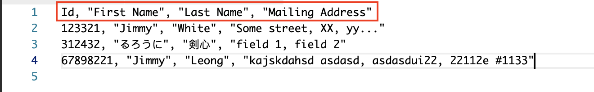
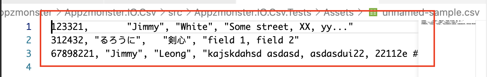

# CsvStreamReader 

A comma separated value (CSV) reader that reads from a stream in a particular encoding.

Example syntax:
```
ICsvCollection csvCollection = null;
using (var reader = new CsvStreamReader(path))
{
    csvCollection = reader.ReadToEnd();
}
```

## Usage
`CsvStreamReader` class is a CSV reader that reads from either a `stream` (instance of `System.IO.Stream`) or file and support 2 types of CSV, **CSV with field name (named CSV)** and **CSV without field name (unnamed CSV)**.

### CSV With Field Name
For CSV with field name, the field name is usually defined at line 1. 

Example:


CSV with field name is useful when the application provides feature for user to upload data in CSV format to the application for processing. For example, user creates a list of users (e.g. first name, last name, role...etc.) in CSV format and upload the file to the application for bulk user account creation.

Using path:
```
string path = "./assets/named-sample.csv";
using (var reader = new CsvStreamReader(path))
{
    ...
}
```

Using stream:
```
string path = "./assets/named-sample.csv";
using (var fileStream = new FileStream(path, FileMode.Open))
{
    using (var reader = new CsvStreamReader(path))
    {
        ...
    }
}
```

The above `CsvStreamReader` instance will use **line 1 as field name** and **line 2 onwards as CSV content**.

In some cases, you may have CSV that uses field name but the **field name is not defined inside the CSV structure**. Such CSV may be generated from application that is unable to include field name inside the CSV data export.

Example:


For such CSV, you can use the following **field name overloaded constructor** of `CsvStreamReader` to specify field names:

```
List<string> csvFieldNames = new List<string>(new[] { "Id", "First Name", "Last Name", "Mailing Address" });

string path = "./assets/unnamed-sample.csv";
using (var reader = new CsvStreamReader(path: path, fieldNames: csvFieldNames))
{
    ...
}
```

### Reading from CSV with Field Name
`CsvStreamReader` class provides the `ReadToEnd` method to read all CSV data from the given CSV (stream or file). It stores the read CSV in an instance of `NamedCsvCollection` and return as `ICsvCollection` interface. `NamedCsvCollection` class is a CSV collection data structure designed for CSV with field name and implements the `ICsvCollection` interface.

The following code shows how to read all CSV and convert the result `ICsvCollection` to `NamedCsvCollecton` instance.
```
string path = "./assets/named-sample.csv";
NamedCsvCollection csvCollection = null;

using (var reader = new CsvStreamReader(path))
{
    csvCollection = reader.ReadToEnd() as NamedCsvCollection;
}

...
```

Converting `ICsvCollection` interface to `NamedCsvCollection` allows you to use `this[index, fieldName]` indexer to read CSV by field name. `ICsvCollection` does not have method signature to read by field name.

> NOTE: `ICsvCollection` interface is the base interface for both `NamedCsvCollection` (CSV with field name) and `UnnamedCsvCollection` (CSV without field name). Likewise, `ICsvCollection` provides the **read by field index** indexer `this[index, fieldIndex]` which can be implemented for both classes. 

```
NamedCsvCollection csvCollection = null;
using (var reader = new CsvStreamReader(path))
{
    csvCollection = reader.ReadToEnd() as NamedCsvCollection;
}

// Get "first name" of 2nd (index = 1) CSV item in the collection.
string value = csvCollection[1, "First Name"];

// Get "last name" of 4th (index = 3) CSV item in the collection.
string value2 = csvCollection(3, "Last Name");
...
```

### CSV Without Field Name
This is similar to CSV that uses field name but the field name is not included in the CSV content. It uses the same **field name overloaded constructor** but **specifies a null or empty field name list to the constructor**.

```
string path = "./assets/unnamed-sample.csv";
using (var reader = new CsvStreamReader(path: path, fieldNames: null))
{
    ...
}
```

The overloaded constructor tells the `CsvStreamReader` to use the externally specified field names but since the field names are empty, it reads the CSV without field name and **derive the number of expected fields based on line 1**.

> NOTE: According to CSV specification, a CSV data structure should have the same number of fields for all collections. Therefore, `CsvStreamReader` uses line 1 to derive the expected number of fields for all the collections for CSV without field names.

### Reading from CSV Without Field Name
`CsvStreamReader` provides the `ReadToEnd` method to read all CSV from the given CSV input and returns an instance of `UnnamedCsvCollection`. Similar to its counterpart `NamedCsvCollection`, the `UnnamedCsvCollection` also implements the `ICsvCollection` interface. However, `UnnamedCsvCollection` is designed for CSV without field name and so it does not have method that uses field name and therefore uses the `this[index, fieldIndex]` indexer to read field value by field index.

```
...

ICsvCollection csvCollection = null;

using (var reader = new CsvStreamReader(path))
{
    csvCollection = reader.ReadToEnd();
}

// Get field value of 2nd (index = 1) CSV item, 3rd (index = 2) field index.
string value = csvCollection[1, 2];
```

>NOTE: You do not need to convert `ICsvCollection` interface to `UnnamedCsvCollection` because `UnnamedCsvCollection` fully implements `ICsvCollection`. As of this writing, `UnnamedCsvCollection` does not have additional methods or properties besides that is specific to `UnnamedCsvCollection`.


## Properties
| Property | Description |
| ---      | ---         |
| `ExpectedFieldCount` | Returns expected total field count. |
| `Count` | Returns total CSV items count. |
| *`FieldNames` | Returns field names (only for `NamedCsvCollection)`). |


## License
Copyright (c) 2021 Jimmy Leong (Github: appzmonster). Licensed under the MIT License.

[Back to main](./README.md#top)
